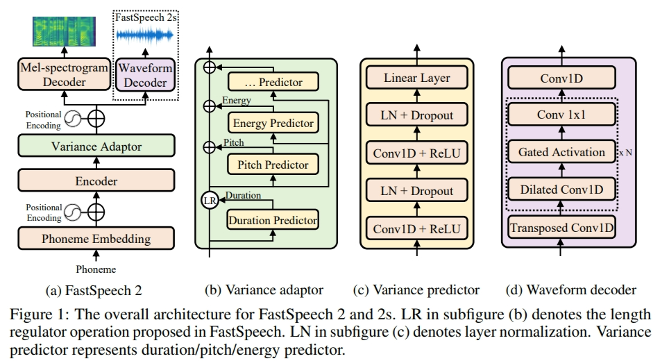

## 본 Repository는 https://github.com/HGU-DLLAB/Korean-FastSpeech2-Pytorch 를 변형한 것 입니다.

# 변경 사항

- hparms.py 내 textgrid_path 변수 추가
- preprocess.py 내 Textgrid.zip의 위치를 옮기는 코드 삭제
- preprocess.py 내 "wavs"와 "wav_bak" 생성시, 발생하는  exist error 수정 (shutill.rmtree)  
- 그 외 각종 버그 수정


# Korean FastSpeech 2 - Pytorch Implementation


# Introduction

최근 딥러닝 기반 음성합성 기술이 발전하며, 자기회귀적 모델의 느린 음성 합성 속도를 개선하기 위해 비자기회귀적 음성합성 모델이 제안되었습니다. FastSpeech2는 비자기회귀적 음성합성 모델들 중 하나로, Montreal Forced Aligner(M. McAuliffe et.al., 2017)에서 phoneme(text)-utterance alignment를 추출한 duration 정보를 학습하고, 이를 바탕으로 phoneme별 duration을 예측합니다. 예측된 duration을 바탕으로 phoneme-utterance alignment가 결정되고 이를 바탕으로 phoneme에 대응되는 음성이 생성됩니다. 그러므로, FastSpeech2를 학습시키기 위해서는 MFA에서 학습된 phoneme-utterance alignment 정보가 필요합니다.

이 프로젝트는 Microsoft의 [**FastSpeech 2(Y. Ren et. al., 2020)**](https://arxiv.org/abs/2006.04558)를 [**Korean Single Speech dataset (이하 KSS dataset)**](https://www.kaggle.com/bryanpark/korean-single-speaker-speech-dataset)에서 동작하도록 구현한 것입니다. 본 소스코드는 ming024님의 [FastSpeech2](https://github.com/ming024/FastSpeech2) 코드를 기반으로 하였고, [Montreal Forced Aligner](https://github.com/MontrealCorpusTools/Montreal-Forced-Aligner)를 이용하여 duration 을 추출해 구현되었습니다.

본 프로젝트에서는 아래와 같은 contribution을 제공합니다.
* kss dataset에 대해 동작하게 만든 소스코드
* Montreal Forced Aligner로부터 추출한 kss dataset의 text-utterance duration 정보 (TextGrid)
* kss dataset에 대해 학습한 FastSpeech2(Text-to-melspectrogram network) pretrained model
* kss dataset에 대해 학습한 [VocGAN](https://arxiv.org/pdf/2007.15256.pdf)(Neural vocoder)의 pretrained model

# Install Dependencies

먼저 python=3.7, [pytorch](https://pytorch.org/)=1.6, [ffmpeg](https://ffmpeg.org/)와 [g2pk](https://github.com/Kyubyong/g2pK)를 설치합니다.
```
# ffmpeg install
sudo apt-get install ffmpeg

# [WARNING] g2pk를 설치하시기 전에, g2pk github을 참조하셔서 g2pk의 dependency를 설치하시고 g2pk를 설치하시기 바랍니다.
pip install g2pk
```

다음으로, 필요한 모듈을 pip를 이용하여 설치합니다.
```
pip install -r requirements.txt
```

**[WARNING] anaconda 가상환경을 사용하시는 것을 권장드립니다.**


# Preprocessing

**(1) 데이터셋 구조 확인**
* 해당 프로젝트는 KSS 데이터셋을 기반으로 작성되었습니다. ([Korean-Single-Speech dataset](https://www.kaggle.com/bryanpark/korean-single-speaker-speech-dataset)) 따라서 KSS 데이터셋과 똑같은 데이터 구조를 맞추어 주는 것이, 진행하기에 편리합니다.


데이터셋은 위와 같은 구조를 이루어야 합니다. 데이터셋안에 1,2,3,4 라는 sub_directory와 폴더 내의 각 wav파일과 그에 대한 transcript을 기록한 Metadata(transcript.v.1.4.txt)가 있어야 합니다.

**(2) MFA Train**

* MFA(Montreal Forced Aligner)는 Fastspeech2 학습에 반드시 필요한, Duration을 추출하기 위해 사용됩니다. MFA는 발화(음성 파일)와 Phoneme sequence간의 alignment를 실행하고 이를 TextGrid라는 파일로 저장합니다. 

MFA 실행에 앞서 다음과 같은 과정이 필요합니다. 

1. wav-lab pair 생성

wav파일과 그 wav파일의 발화를 transcript한 lab파일이 필요합니다.

utils.ipynb 노트북 내의 audio_text_pair 함수를 실행하시면 됩니다.

해당 함수는 metadata로 부터 wav파일과 text를 인식하여, wav파일과 확장자만 다른 transcript파일(.lab) 을 생성합니다. 


작업이 끝나면 위의 형태와 같이 wav-lab pair가 만들어져야 합니다.


2. lexicon 파일 생성 
 
가지고 있는 데이터셋 내의 모든 발화에 대한, phoneme을 기록한 lexicon 파일을 생성합니다.

utils.ipynb 노트북 내의 make_p_dict 함수를 실행해주세요.


작업이 끝나면 위와 같은 형태를 띄는 p_lexicon.txt 파일이 만들어집니다. 


3. MFA 설치 

* MFA에 대한 자세한 설치 방법은 https://montreal-forced-aligner.readthedocs.io/en/latest/installation.html 이곳은 확인해주세요.


4. MFA 실행

MFA의 경우 pre-trained된 한국어 acoustic model과 g2p 모델을 제공하고 있습니다. 하지만 해당 모델은 english phoneme을 생성하기 때문에 한국어 phoneme을 생성하기 위해서는 직접 train을 시켜주어야 합니다.

MFA 설치가 완료되었다면 아래와 같은 커멘드를 실행해주세요.

```
mfa train <데이터셋 위치> <p_lexicon의 위치> <out directory>
```

MFA가 정상적으로 실행되었을 경우 다음과 같은 형태의 TextGrid 파일이 만들어집니다.


**(3) 데이터전처리**

1.hparms.py

- dataset : 데이터셋 폴더명
- data_path : dataset의 상위 폴더
- meta_name : metadata의 파일명 ex)transcript.v.1.4.txt
- textgrid_path : textgrid 압축 파일의 위치 (textgrid 파일들을 미리 압축해주세요)
- tetxgrid_name : textgird 압푹 파일의 파일명

2. preprocess.py


해당 부분을 본인의 데이터셋 이름에 맞게 변경해주세요


3. data/kss.py

- line 19 : basename,text = parts[?],parts[?]  #각각 텍스트의 위치 ("|")로 split했을때, metadata에 기록된 wav와 text의 위치
- line 37 : basename,text = parts[?],parts[?]


위의 변경 작업이 모두 완료되면 아래의 커멘드를 실행해주세요.

```
python preprocess.py
```
    
# Train
모델 학습 전에, kss dataset에 대해 사전학습된 VocGAN(neural vocoder)을 [다운로드](https://drive.google.com/file/d/1GxaLlTrEhq0aXFvd_X1f4b-ev7-FH8RB/view?usp=sharing) 하여 ``vocoder/pretrained_models/`` 경로에 위치시킵니다.

다음으로, 아래의 커맨드를 입력하여 모델 학습을 수행합니다.
```
python train.py
```
학습된 모델은 ``ckpt/``에 저장되고 tensorboard log는 ``log/``에 저장됩니다. 학습시 evaluate 과정에서 생성된 음성은 ``eval/`` 폴더에 저장됩니다.

# Synthesis
학습된 파라미터를 기반으로 음성을 생성하는 명령어는 다음과 같습니다. 
```
python synthesis.py --step 500000
```
합성된 음성은  ```results/``` directory에서 확인하실 수 있습니다.

# Pretrained model
pretrained model(checkpoint)을 [다운로드](https://drive.google.com/file/d/1qkFuNLqPIm-A5mZZDPGK1mnp0_Lh00PN/view?usp=sharing)해 주세요.
그 후,  ```hparams.py```에 있는 ```checkpoint_path``` 변수에 기록된 경로에 위치시켜주시면 사전학습된 모델을 사용 가능합니다.

# Tensorboard
```
tensorboard --logdir log/hp.dataset/
```
tensorboard log들은 ```log/hp.dataset/``` directory에 저장됩니다. 그러므로 위의 커멘드를 이용하여 tensorboard를 실행해 학습 상황을 모니터링 하실 수 있습니다.


# References
- [FastSpeech 2: Fast and High-Quality End-to-End Text to Speech](https://arxiv.org/abs/2006.04558), Y. Ren, *et al*.
- [FastSpeech: Fast, Robust and Controllable Text to Speech](https://arxiv.org/abs/1905.09263), Y. Ren, *et al*.
- [ming024's FastSpeech2 impelmentation](https://github.com/ming024/FastSpeech2)
- [rishikksh20's VocGAN implementation](https://github.com/rishikksh20/VocGAN)
- [HGU-DLLAB](https://github.com/HGU-DLLAB/Korean-FastSpeech2-Pytorch)
- [TensorSpeech](https://github.com/TensorSpeech/TensorFlowTTS)
